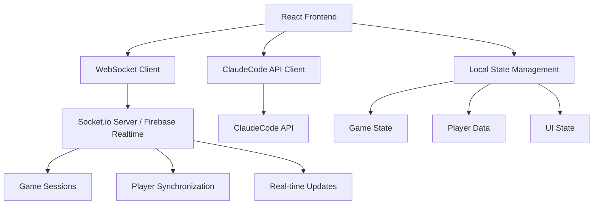
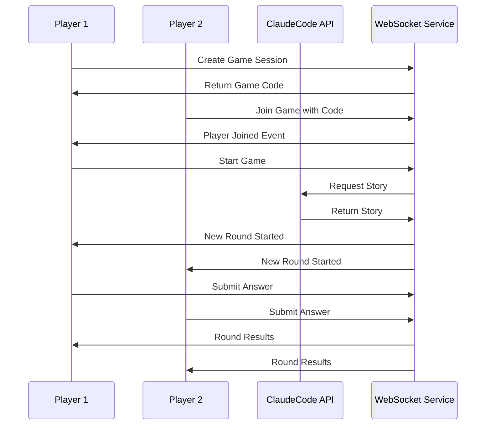

# Design Document

## Overview

StoryTrue is a React-based multiplayer trivia application that combines real-time gameplay with AI-generated content. The architecture follows a client-side approach suitable for GitHub Pages deployment, utilizing WebSocket connections for real-time synchronization and the ClaudeCode API for dynamic story generation. The design emphasizes responsive mobile-first UI with playful visual elements and seamless multiplayer experiences.

## Architecture

### High-Level Architecture



### Technology Stack

- **Frontend Framework:** React 18 with functional components and hooks
- **State Management:** React Context API + useReducer for complex game state
- **Real-time Communication:** Socket.io-client or Firebase Realtime Database
- **UI Framework:** Chakra UI for rapid prototyping and consistent design
- **Styling:** Emotion (built into Chakra UI) with custom theme
- **API Integration:** Axios for HTTP requests to ClaudeCode API
- **Build Tool:** Vite for fast development and optimized builds
- **Deployment:** GitHub Pages with GitHub Actions for CI/CD

### Deployment Architecture

Since GitHub Pages only supports static hosting, the real-time functionality will be handled through:
- **Option A:** Firebase Realtime Database (recommended for simplicity)
- **Option B:** External WebSocket service (Heroku, Railway, or similar)

## Components and Interfaces

### Core Components Structure

```
src/
├── components/
│   ├── common/
│   │   ├── Avatar.jsx
│   │   ├── LoadingSpinner.jsx
│   │   └── ErrorBoundary.jsx
│   ├── game/
│   │   ├── GameLobby.jsx
│   │   ├── StoryCard.jsx
│   │   ├── ScoreBoard.jsx
│   │   └── PlayerList.jsx
│   ├── forms/
│   │   ├── TopicSelector.jsx
│   │   ├── JoinGameForm.jsx
│   │   └── CreateGameForm.jsx
│   └── layout/
│       ├── Header.jsx
│       ├── Navigation.jsx
│       └── GameLayout.jsx
├── contexts/
│   ├── GameContext.jsx
│   ├── PlayerContext.jsx
│   └── SocketContext.jsx
├── hooks/
│   ├── useGameState.js
│   ├── useSocket.js
│   └── useClaudeAPI.js
├── services/
│   ├── claudeAPI.js
│   ├── socketService.js
│   └── gameService.js
├── utils/
│   ├── gameLogic.js
│   ├── validation.js
│   └── constants.js
└── pages/
    ├── Home.jsx
    ├── CreateGame.jsx
    ├── JoinGame.jsx
    ├── GameLobby.jsx
    ├── GamePlay.jsx
    └── Results.jsx
```

### Key Component Interfaces

#### GameContext Interface
```typescript
interface GameContextType {
  gameState: GameState;
  players: Player[];
  currentStory: Story | null;
  scores: Record<string, number>;
  gamePhase: 'lobby' | 'playing' | 'results';
  actions: {
    createGame: (topics: string[]) => Promise<string>;
    joinGame: (code: string, playerName: string) => Promise<void>;
    startGame: () => void;
    submitAnswer: (answer: boolean) => void;
    nextRound: () => void;
  };
}
```

#### Story Interface
```typescript
interface Story {
  id: string;
  text: string;
  isTrue: boolean;
  explanation: string;
  topic: string;
  difficulty: 'easy' | 'medium' | 'hard';
}
```

#### Player Interface
```typescript
interface Player {
  id: string;
  name: string;
  avatar: string;
  score: number;
  isHost: boolean;
  isConnected: boolean;
  currentAnswer?: boolean;
}
```

## Data Models

### Game Session Model
```typescript
interface GameSession {
  id: string;
  code: string;
  hostId: string;
  topics: string[];
  players: Player[];
  currentRound: number;
  maxRounds: number;
  phase: 'waiting' | 'lobby' | 'playing' | 'finished';
  currentStory?: Story;
  roundStartTime?: number;
  createdAt: number;
}
```

### Game State Management
The application uses a centralized state management approach:

1. **GameContext** - Manages overall game state and actions
2. **Local Component State** - Handles UI-specific state (forms, modals, etc.)
3. **Real-time Synchronization** - Syncs critical game state across all players

### Data Flow


## Error Handling

### API Error Handling
- **ClaudeCode API Failures:** Implement retry logic with exponential backoff, fallback to curated story database
- **Network Connectivity:** Show connection status, queue actions for retry when reconnected
- **Rate Limiting:** Implement request throttling and user feedback for API limits

### Real-time Connection Handling
- **WebSocket Disconnection:** Automatic reconnection with exponential backoff
- **Player Disconnection:** Graceful handling with reconnection window (60 seconds)
- **Game State Desync:** Periodic state reconciliation and conflict resolution

### User Experience Error Handling
- **Invalid Game Codes:** Clear error messages with suggestions
- **Full Game Sessions:** Informative messages with alternative actions
- **Browser Compatibility:** Feature detection and graceful degradation

### Error Boundary Implementation
```jsx
class GameErrorBoundary extends React.Component {
  constructor(props) {
    super(props);
    this.state = { hasError: false, error: null };
  }

  static getDerivedStateFromError(error) {
    return { hasError: true, error };
  }

  componentDidCatch(error, errorInfo) {
    console.error('Game Error:', error, errorInfo);
    // Log to error reporting service
  }

  render() {
    if (this.state.hasError) {
      return <ErrorFallback error={this.state.error} />;
    }
    return this.props.children;
  }
}
```

## Testing Strategy

### Unit Testing
- **Components:** React Testing Library for component behavior testing
- **Hooks:** Custom hook testing with renderHook utility
- **Services:** Jest for API service and game logic testing
- **Utilities:** Pure function testing for game calculations

### Integration Testing
- **Game Flow:** End-to-end user journey testing
- **Real-time Features:** WebSocket connection and synchronization testing
- **API Integration:** ClaudeCode API integration testing with mocks

### Testing Structure
```
src/
├── __tests__/
│   ├── components/
│   ├── hooks/
│   ├── services/
│   └── utils/
├── __mocks__/
│   ├── claudeAPI.js
│   ├── socketService.js
│   └── firebase.js
└── test-utils/
    ├── renderWithProviders.jsx
    ├── mockGameState.js
    └── testHelpers.js
```

### Performance Testing
- **Bundle Size:** Webpack Bundle Analyzer for optimization
- **Rendering Performance:** React DevTools Profiler
- **Network Performance:** Lighthouse audits for web vitals

### Accessibility Testing
- **Screen Reader Compatibility:** NVDA/JAWS testing
- **Keyboard Navigation:** Full keyboard accessibility
- **Color Contrast:** WCAG 2.1 AA compliance
- **Focus Management:** Proper focus handling during game state changes

## Mobile-First Responsive Design

### Breakpoint Strategy
```css
// Mobile First Approach
$breakpoints: (
  sm: 480px,   // Small phones
  md: 768px,   // Tablets
  lg: 1024px,  // Small laptops
  xl: 1200px   // Desktop
);
```

### Component Responsiveness
- **GameLobby:** Stack players vertically on mobile, grid on desktop
- **StoryCard:** Full-width on mobile with larger touch targets
- **ScoreBoard:** Horizontal scroll on mobile, fixed layout on desktop
- **Navigation:** Hamburger menu on mobile, horizontal nav on desktop

### Touch Optimization
- Minimum 44px touch targets for buttons
- Swipe gestures for story navigation
- Pull-to-refresh for game state updates
- Haptic feedback for answer submissions (where supported)

## Security Considerations

### Client-Side Security
- **Input Validation:** Sanitize all user inputs (names, custom topics)
- **XSS Prevention:** Use React's built-in XSS protection
- **API Key Management:** Environment variables for sensitive keys
- **Rate Limiting:** Client-side request throttling

### Game Integrity
- **Answer Validation:** Server-side answer verification
- **Score Tampering:** Server-authoritative scoring
- **Session Security:** Secure game code generation
- **Player Authentication:** Basic player verification

## Performance Optimization

### Code Splitting
```jsx
// Lazy load game components
const GamePlay = lazy(() => import('./pages/GamePlay'));
const Results = lazy(() => import('./pages/Results'));

// Route-based code splitting
<Suspense fallback={<LoadingSpinner />}>
  <Routes>
    <Route path="/play" element={<GamePlay />} />
    <Route path="/results" element={<Results />} />
  </Routes>
</Suspense>
```

### State Optimization
- **Memoization:** React.memo for expensive components
- **Callback Optimization:** useCallback for event handlers
- **State Normalization:** Flat state structure for better performance

### Asset Optimization
- **Image Optimization:** WebP format with fallbacks
- **Font Loading:** Preload critical fonts
- **Bundle Splitting:** Separate vendor and app bundles
- **Service Worker:** Cache static assets for offline capability